# 🛠️ Quinn’s CAD Portfolio

Hello! I’m Quinn—a biomedical engineering graduate currently earning my **CAD & Drafting-Advanced Technology Certificate** at **Lee College**. I specialize in 2D and 3D technical design using **AutoCAD**and am building this portfolio to showcase my progress and skill development in real time.

---

## ✏️ DFTG 1409 – Basic Computer-Aided Drafting Projects

This section showcases selected drawings and practice assignments completed during my **DFTG 1409 – Technical Drafting** course at Lee College. All work was created using **AutoCAD**, focusing on 2D orthographic layouts, dimensioning, section views, and isometric drawing fundamentals.

---

### 📸 Class Project Gallery

<table>
  <tr>
    <td align="center">
       
      Base Plate
    </td>
    <td align="center">
       
      Stepped Shaft
    </td>
    <td align="center">
       
      Mounting Plate
    </td>
  </tr>
  <tr>
    <td align="center">
       
      Test Bracket
    </td>
    <td align="center">
       
      Floor Framing
    </td>
    <td align="center">
       
      Grill
    </td>
  </tr>
   <tr>
    <td align="center">
       
      Hearth
    </td>
    <td align="center">
       
      Flanged Bushing
    </td>
    <td align="center">
       
      Sprocket
    </td>
  </tr>
   <tr>
    <td align="center">
       
      Text Exercise
    </td>
    <td align="center">
       
      Tool Block
    </td>
    <td align="center">
       
      Control Panel
    </td>
  </tr>
   <tr>
    <td align="center">
       
      Gazebo
    </td>
    <td align="center">
       
      Isometrics Arm 1 and 2
    </td>
    <td align="center">
       
      Final 3D Assembly
    </td>
  </tr>
</table>

> *All designs created as part of in-class assignments to strengthen foundational CAD drawing skills.*
> *Want to view a specific drawing or request the file? [Contact me on LinkedIn at https://www.linkedin.com/in/makayla-quinn/)*  

---
## ✏️ DFTG 2419 – Intermediate Computer-Aided Drafting Projects 

This section showcases selected drawings and practice assignments completed during my **DFTG 2419 – Intermediate Technical Drafting** course at Lee College. All work is created using **AutoCAD**, focusing on the development and use of prototype drawings, the creation of pictorial drawings, data extraction, and the basics of creating 3-D drawings.

---
### 📸 Class Project Gallery

<table>
  <tr>
    <td align="center">
      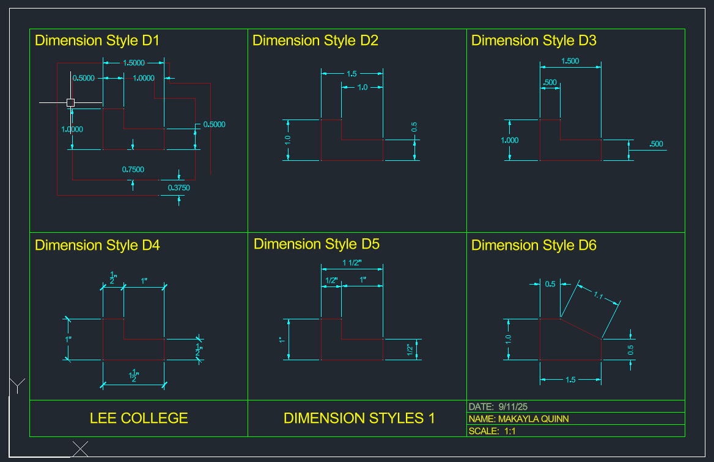 
      Dimension Styles 1
    </td>
    <td align="center">
      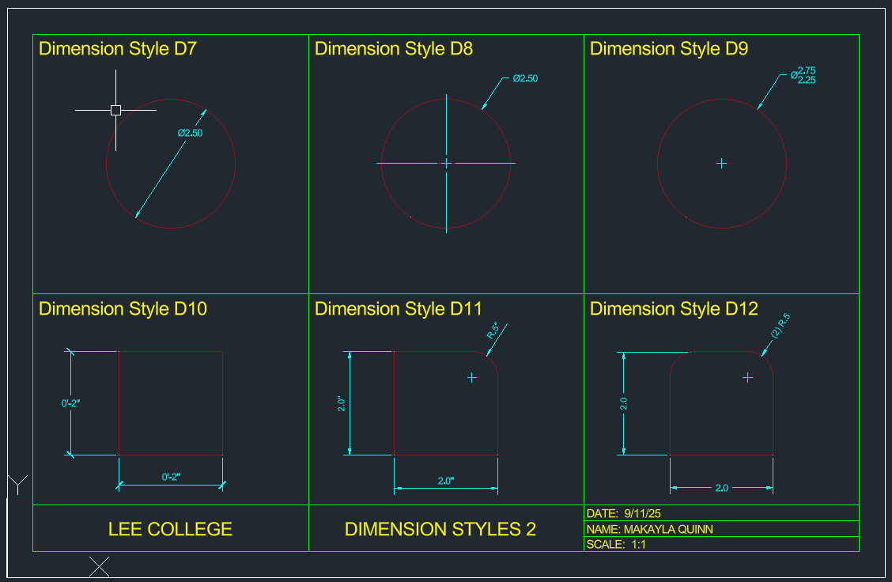 
      Dimension Styles 2
    </td>
    <td align="center">
      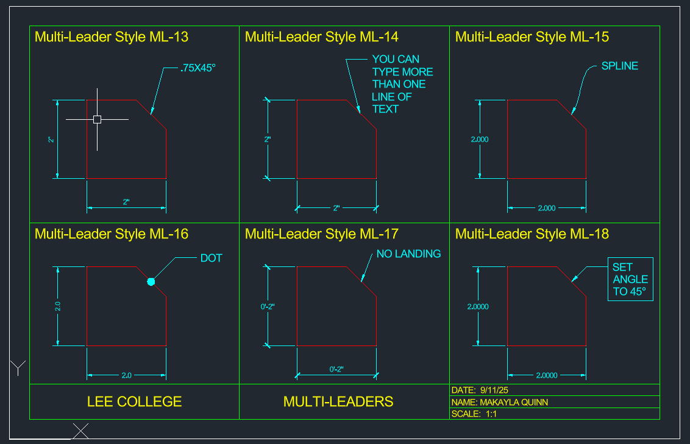 
      Multi-Leaders
    </td>
  </tr>
  <tr>
    <td align="center">
      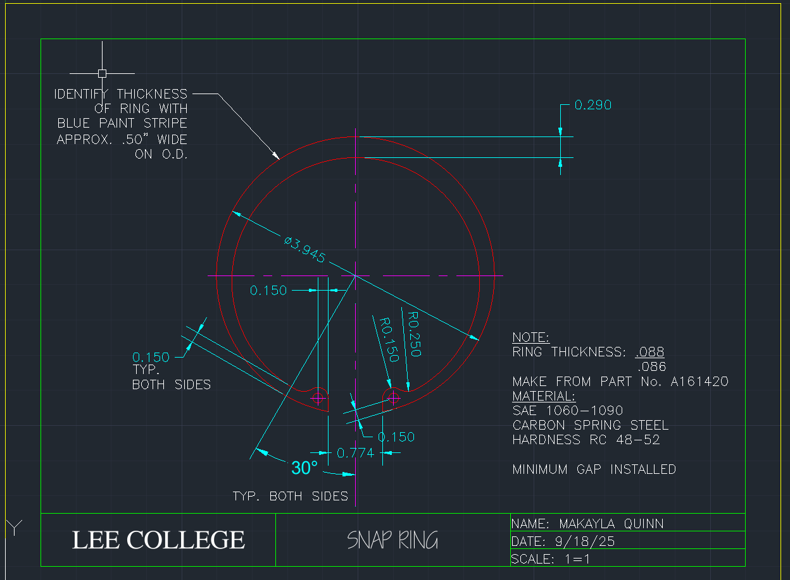 
      Snap Ring
    </td>
    <td align="center">
      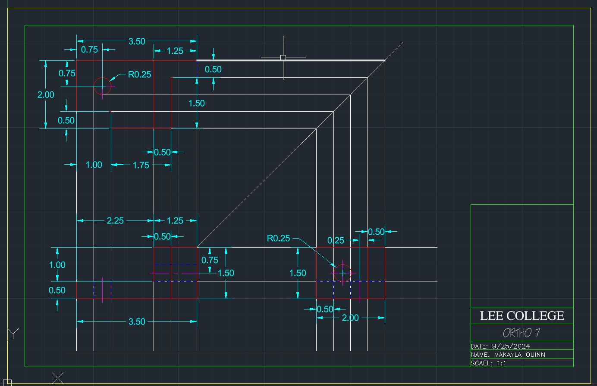 
      Orthographic Projection
    </td>
    <td align="center">
      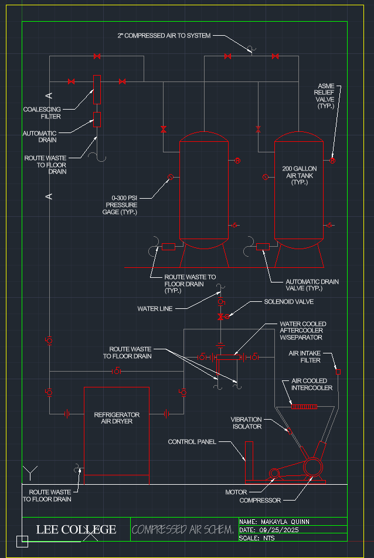 
      Compressed Air Schematic
    </td>
  </tr>
   <tr>
    <td align="center">
      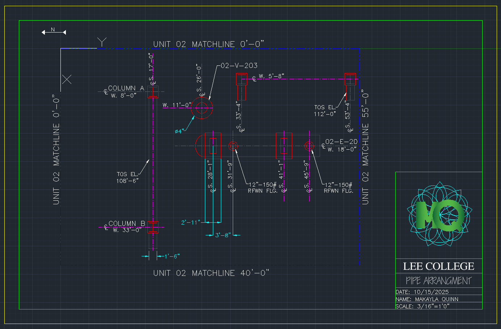 
      Pipe Layout
    </td>
    <td align="center">
      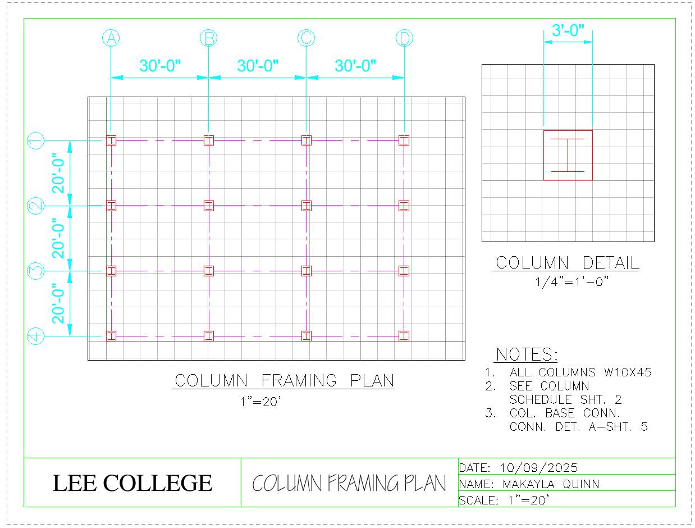 
      Column Framing Plan
    </td>
    <td align="center">
      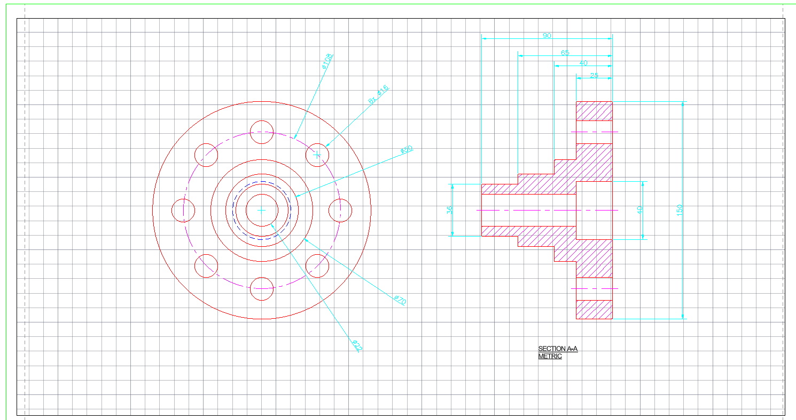 
      Metric Hub
    </td>
  </tr>
   <tr>
    <td align="center">
      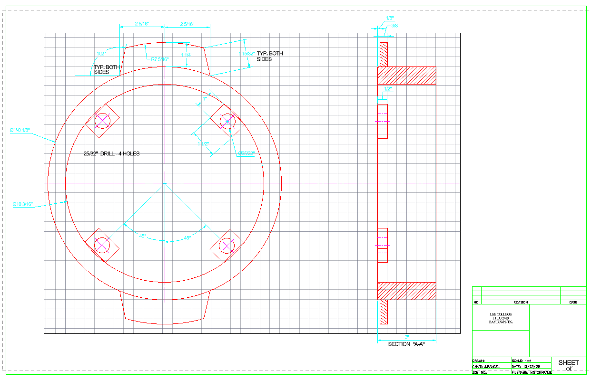 
      Motor Frame Ring
    </td>
    <td align="center">
      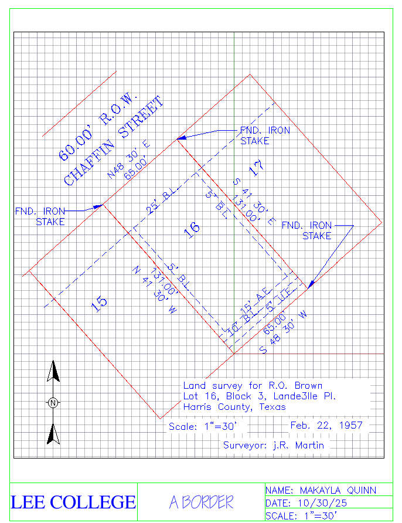 
      Civil Drawing 1
    </td>
    <td align="center">
      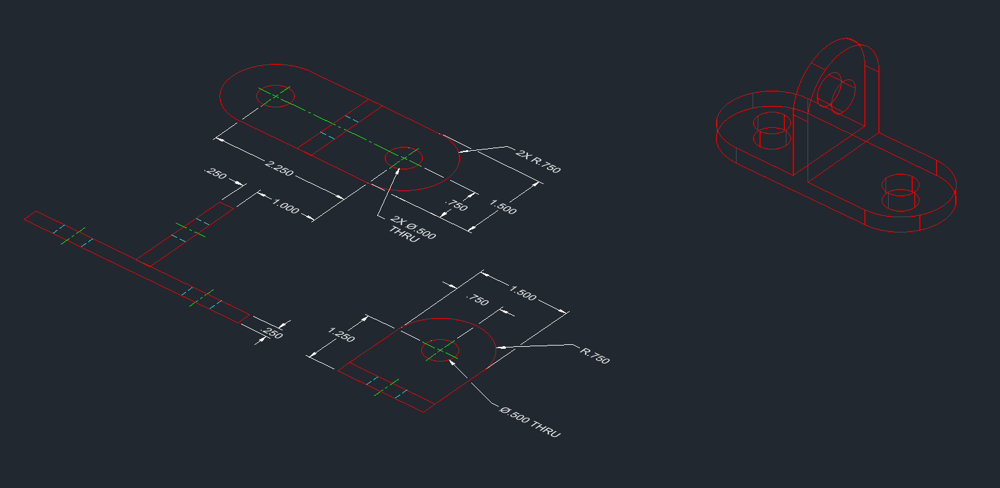 
      3D Bracket
    </td>
  </tr>
   <tr>
    <td align="center">
      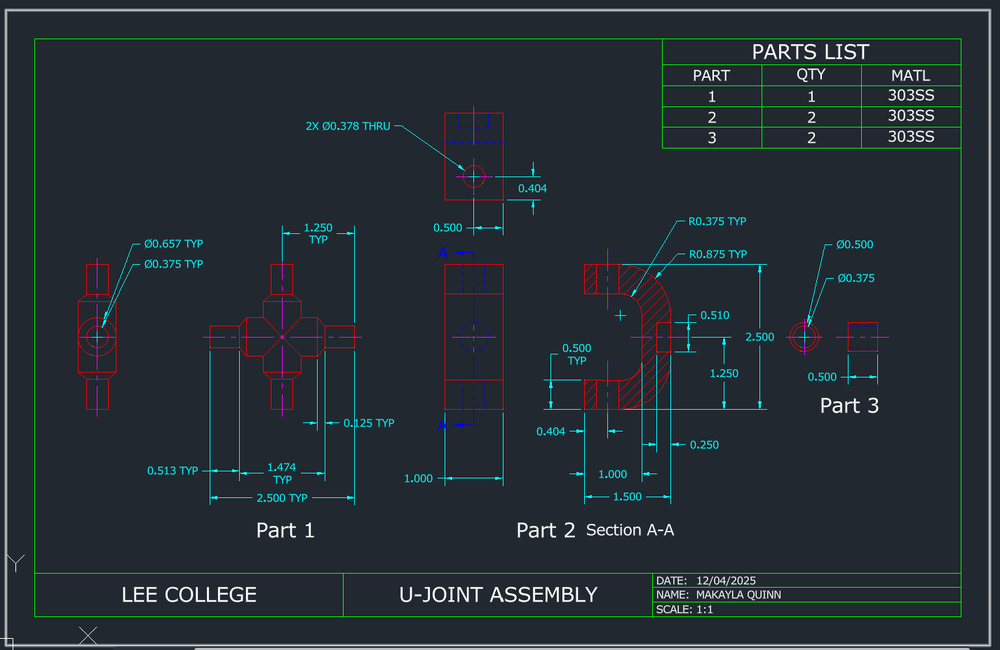 
      Final: U-Joint
    </td>
  </tr>
</table>

> *All designs created as part of in-class assignments to strengthen foundational CAD drawing skills.*

---

## ✏️ DFTG 2408 – Instrumentation Drafting (Current courses for Fall 2025)

This section showcases selected drawings and practice assignments completed during my **DFTG 2408 – Instrumentation Drafting** course at Lee College. All work is created using **AutoCAD**, focusing on the principles of instrumentation applicable to industrial applications, the fundamentals of measurement and control devices, current ISA (Instrument Society of America) symbology, basic flow sheet layout, and drafting practices.

---
### 📸 Class Project Gallery

<table>
  <tr>
    <td align="center">
       
      Legend
    </td>
    <td align="center">
       
      PFD
    </td>
    <td align="center">
       
      PID
    </td>
  </tr>
  <tr>
    <td align="center">
       
      Loop Diagram
    </td>
    <td align="center">
       
      Equiptment Location
    </td>
  </tr>
</table>

## ✏️ DFTG 2432 – Advanced Computer-Aided Drafting (Current courses for Spring 2026)

This section showcases selected drawings and practice assignments completed during my **DFTG 2408 – Instrumentation Drafting** course at Lee College. All work is created using **AutoCAD**, focusing on advanced CAD technologies, including animation, rendering, and 3D modeling and output.

## ✏️ CNBT 1442 – Building Codes and Inspections (Current courses for Spring 2026)

This section showcases selected drawings and practice assignments completed during my **CNBT 1442 – Building Codes and Inspections ** course at Lee College. All work is created using **AutoCAD**, focusing on identifying various construction classifications and occupancy categories, cross-referencing the guidelines, tables, charts, and specifications as presented in the building codes, and determining if construction meets the building codes and standards. 

## 📂 Other Projects

### 📐 Orthopedic Index Finger Splint (Personal Project)
**Software:** AutoCAD  
**Focus:** Precision part modeling, curvature handling, and technical drawing layout.  
**Notes:** Modeled a simplified orthopedic finger splint as part of a personal project emphasizing medical device design.  
Orthopedic Index Finger Splint  

---

## Tools & Skills
- AutoCAD 2D Drafting & 3D Modeling  
- Technical Drawings & Annotation  
- CAD Concept Design  
- Engineering Problem-Solving  
- In Progress: Building a portfolio of real-world-ready models and technical diagrams  

---

## Contact  
- 🧩 **CAD Crowd:** [https://www.cadcrowd.com/profile/194433-quinncad)
- 🌐 **Website:** [https://quinncad.github.io](https://quinncad.github.io)

Thanks for visiting! New designs and updates are coming soon 
